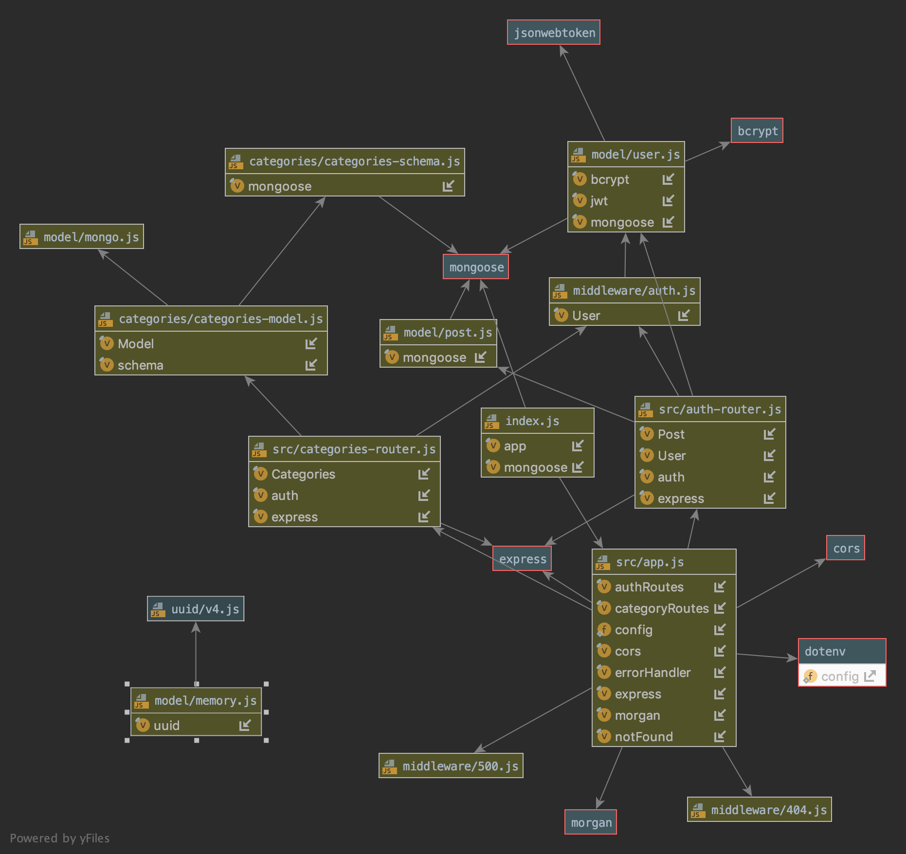

# LAB - 15

## API Server

### Author: Lillian Gales

### Links and Resources
* [submission PR](http://xyz.com)
* [travis](https://travis-ci.com/lilliangales-401-advanced-javascript/lab15-api-server)
* [front-end](http://xyz.com) 

#### Documentation
* [jsdoc](http://xyz.com) (Server assignments)

### Modules
#### `404.js`
#### `500.js`
#### `auth.js`
#### `categoris-router.js`
#### `auth-router.js`

 ###### 
`get(category) -> promise`
`post(category) -> promise`
`put(category) -> promise`
`delete(category) -> promise`

### Setup
#### `.env` requirements
* `PORT` - 3000
* `MONGODB_URI` - mongodb://localhost:27017/lab15
* `SECRET` - secreto

#### Running the app
* `npm start`

#### UML

